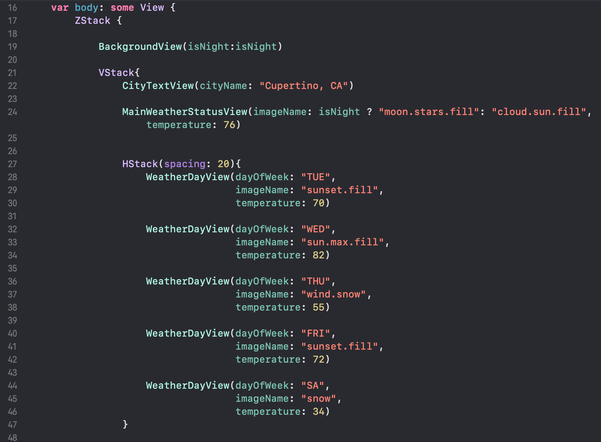
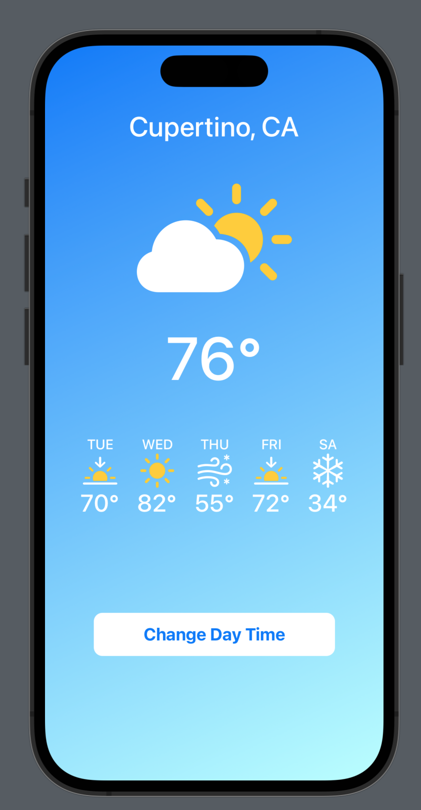
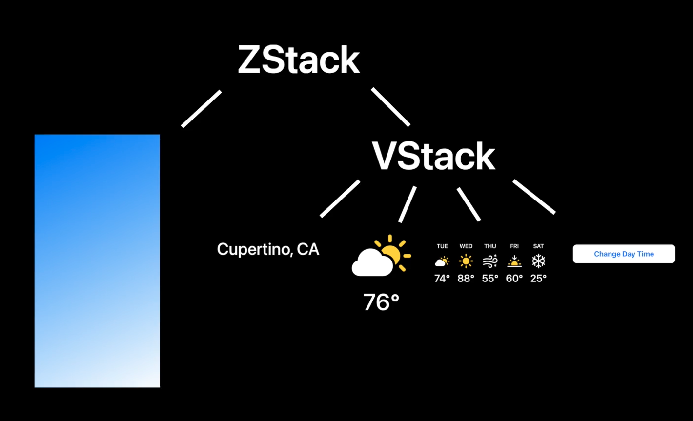
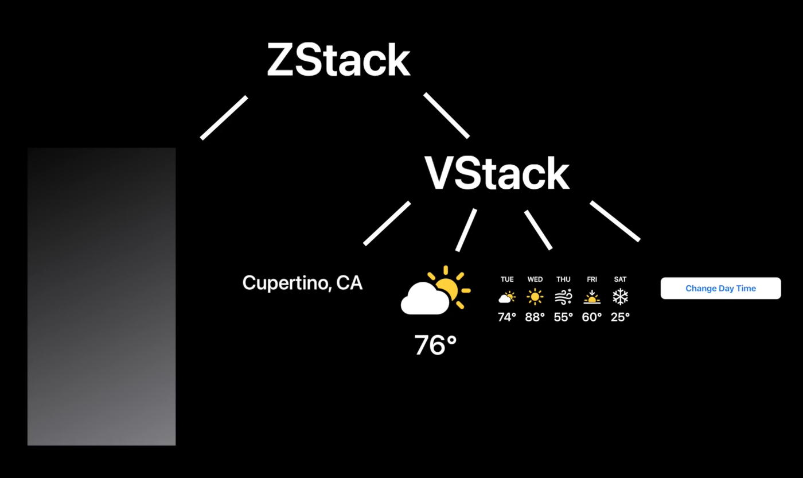
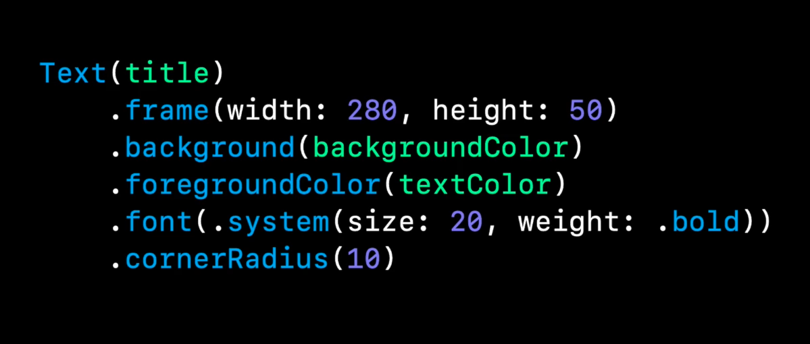
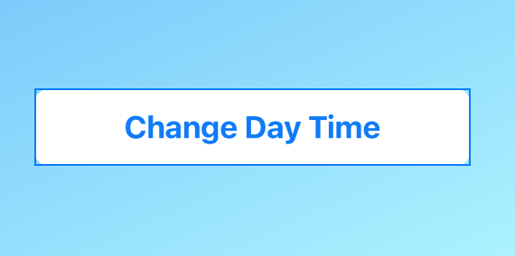
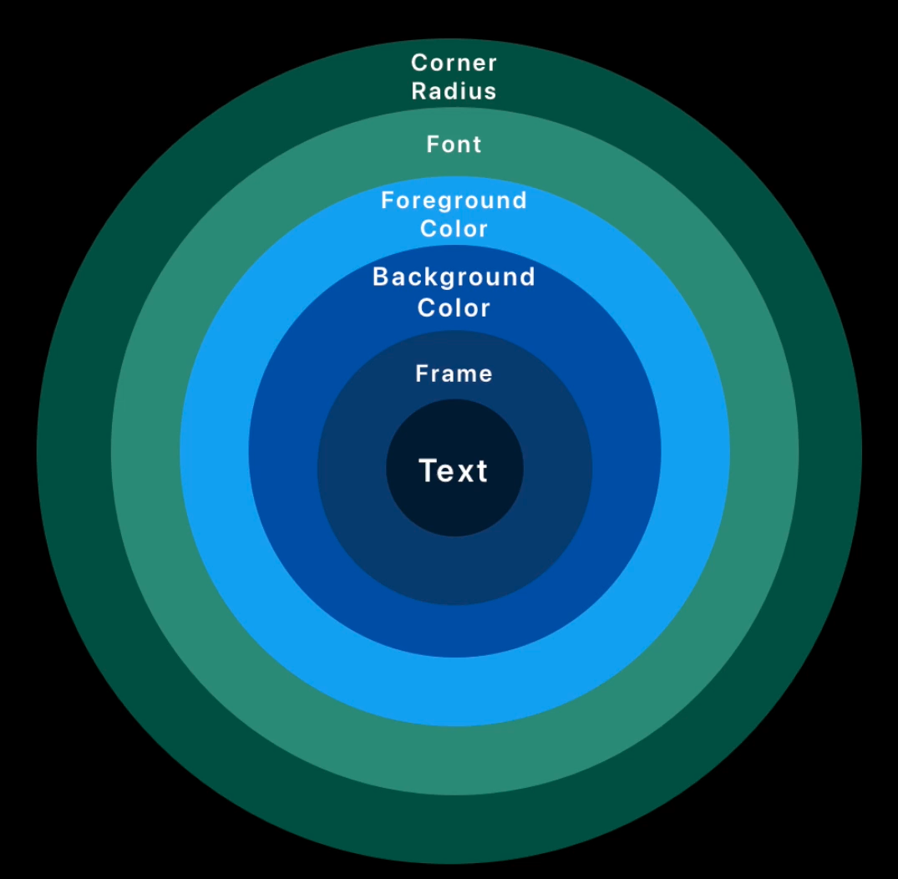
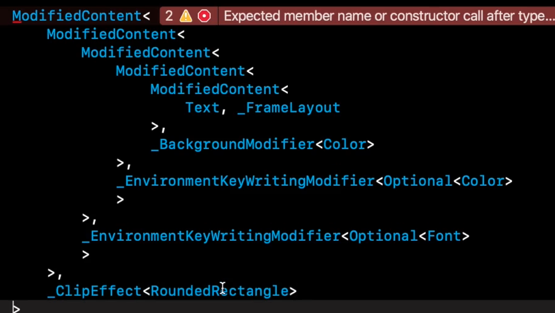
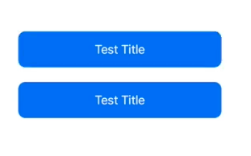

# How Swift UI works and View Trees

In the past when we used UIKIt, a UIButton **inherits** from UIVIew. This means that both UIButton and UIView are **classes**.

One problem here is that maybe when using a UIButton we don't use all the methods and attributes inherited from UIView. This means that we are using more memory than we need to.

In Swift UI, a Button is a **struct** and a View is a **protocol**. This means that Buttons and Views are **not** classes, they are **value types**. This means that when you create a Button, you are creating a new instance of a Button, not a reference to a Button. This is a big difference from UIKit.

There is no inheritance going on in Swift UI, each component is super lightweight and performant, they are re-render, created and destroy all the time in SwiftUI.

## View Trees

Looking at SwiftUI code you can see that we have nested components.



ZStack > VStack > HStack > Text, etc




**When a change in the state happens**: SwiftUI goes through the view tree and check what changed, then it re-renders only that components.

In our app, when we change to night mode, SwiftUI will only re-render the branches that are affected, like the background and the sun/moonlight icon. But not the other branches with the days of the week.



## Imperative vs Declarative

UIKit is imperative, we have a UI layer and a logic layer, we need to go and tell to the UI when something change.

SwiftUI is declarative, we just declare what we want to see with all possible rules and SwiftUI will take care of the rest.

# View Builders

The opening and close brackets in SwiftUI are called **View Builders**.

```swift
VStack { // Start of view builder
    Text("Hello World")
} // End of view builder
```

View builders are limited, you cannot write any type of code inside of them.

Go to the VStack declaration, you will find the @ViewBuilder attribute in its initializer.

```swift
 @inlinable public init(alignment: HorizontalAlignment = .center, spacing: CGFloat? = nil, @ViewBuilder content: () -> Content)
```

It returns "Content", which must agree with the View type.

@ViewBuilder makes the scope different, limited to the type of code that we can write inside of it.

Example of an if condition inside a View Builder:

```swift
VStack { // Start of view builder
    if isLoading {
        LoadingIndicator()
    } else {
        ItemView()
    }
} // End of view builder
```

If you try to add a lot of code inside a View Builder, you will get an error. Usually you are limited to some control flow and adding things to the View Tree.

# Modifiers



### Always Remember:

**Every time you add a modifier into a view, you are wrapping that view into another view.**

That is why **order** in modifiers **matters**.

Example, look at the following code:

```swift
struct WeatherButton: View {

    var title: String
    var textColor: Color
    var backgroundColor: Color

    var body: some View {
        Text(title)
            .frame(width: 280, height: 50)  // Lets change the order of this modifier
            .background(backgroundColor)
            .foregroundColor(textColor)
            .font(.system(size: 20, weight: .bold, design: .default))
            .cornerRadius(10)
    }
}

```

Result:



After the change:

```swift
struct WeatherButton: View {

    var title: String
    var textColor: Color
    var backgroundColor: Color

    var body: some View {
        Text(title)
            .background(backgroundColor)
            .foregroundColor(textColor)
            .font(.system(size: 20, weight: .bold, design: .default))
            .cornerRadius(10)
            .frame(width: 280, height: 50) // New place
    }
}

```

Result:


Look at the blue rectangles that XCode give us to denote the actual component.

\*_Every time you add a modifier into a view, it returns a NEW view, and then you can keep adding modifiers_

```swift
struct WeatherButton: View {

    var title: String
    var textColor: Color
    var backgroundColor: Color

    var body: some View {
        Text(title)
            .frame(width: 280, height: 50)  // NEW View : Text + frame
            .background(backgroundColor)  // NEW View : Text + frame + background
            .foregroundColor(textColor) // NEW View : Text + frame + background + foreground
            .font(.system(size: 20, weight: .bold, design: .default)) // NEW View : Text + frame + background + foreground + font
            .cornerRadius(10) // NEW View : Text + frame + background + foreground + font + cornerRadius
    }
}

```

It is a recursive process, you add a modifier, you get a new view where you can add another modifier:



Example, printing the modifiers tree of a view:

```swift
VStack {
    // ...
}
.onAppear {
    let button = WeatherButton(title:"Hello"m textColor: .white, backgroundColor: .blue)

    print(type(of: button))
}
```

Result of printing `print(type(of: button))` :



Notice that there are some _Environment Modifiers_ in the previous image.

Environment modifiers are modifiers that are applied to the entire view tree, to all the children of the view.

```swift
struct WeatherButton: View {

    var title: String
    var textColor: Color
    var backgroundColor: Color

    var body: some View {
        VStack{
             Text(title)
            .background(backgroundColor)
            .cornerRadius(10)
            .frame(width: 280, height: 50)

             Text(title)
            .background(backgroundColor)
            .cornerRadius(10)
            .frame(width: 280, height: 50)
        }
        .foregroundColor(textColor) // Environment modifier, applied to all the children, all the buttons will have this color
        .font(.system(size: 20, weight: .bold, design: .default)) // Environment modifier, applied to all the children, all the buttons will have this font

    }
}

```



## Specific Modifiers

The **bold** modifier only applies to Text views, not to other views.

```swift
Text(title)
    .frame(width: 280, height: 50)
    .bold() // DOES NOT WORK
```

The previous code is broken, because first we have a Text view, then whe wrap it with a frame modifier, so we get a NEW view, which doesn't have the "Text" type anymore, so the _bold_ modifier doesn't exist anymore.

Instead we should do this:

```swift
Text(title)
    .bold() // This works !
    .frame(width: 280, height: 50)
```

Apply the bold modifier first, and then the frame modifier

**Tip:** experience will help you to know the modifiers order, and the open specific to each view.
